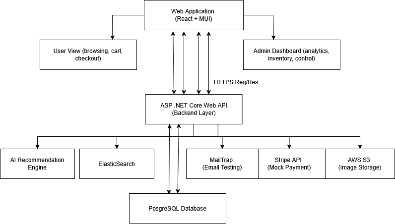

# 🛍️ Apparel E-Commerce & Automation Platform

A full-stack, AI-powered e-commerce and automation platform designed specifically for clothing and merchandise-based businesses. Built with ASP.NET Core, React, PostgreSQL, and integrated with machine learning for personalized product recommendations.

---

## 📌 Table of Contents

- [Features](#️-features)
- [Tech Stack](#-tech-stack)
- [System-Architecture](#️-system-architecture)
- [Getting Started](#-getting-started)
- [AI Recommendation Engine](#-ai-recommendation-engine)
- [Project Structure](#-project-structure)
- [Challenges](#-challenges)
- [Future Work](#-future-work)
- [License](#-license)
- [Acknowledgments](#-acknowledgments)


---

## ✅ Features

- Full user and admin dashboards
- Inventory tracking and bulk CSV uploading
- AI-powered product recommendation system
- Secure authentication and role-based access
- Product analytics and user interaction tracking
- Stripe mock checkout integration
- AWS S3-based image storage
- ElasticSearch-based search functionality
- Responsive UI with React + Material UI

---

## 💻 Tech Stack

**Frontend**  
- React.js  
- Material UI

**Backend**  
- ASP.NET Core 9.0  
- Entity Framework Core  
- PostgreSQL  
- ElasticSearch

**Machine Learning**  
- Python  
- scikit-learn  
- LightFM  
- TensorFlow  
- NumPy

**APIs & External Services**  
- MailTrap (email testing)  
- Stripe (mock payment)  
- AWS S3 (image upload and storage)

---

## 🧱 System Architecture



---

## 🚀 Getting Started

### Prerequisites

- .NET SDK 9.0+
- Node.js (LTS version)
- PostgreSQL
- Python 3.8+
- ElasticSearch
- AWS account (for S3 usage)
- Docker (optional for ElasticSearch)

### Installation

1. **Clone the repository**
```bash
git clone https://github.com/Mhmd99998/StyleSync.git
cd your-repo-name
```

2. **Set up environment variables (see ```appsettings.json```)**

3. **Run backend**
```bash
cd backend
dotnet build
dotnet run
```
4. **Run frontend**
```bash
cd frontend
npm install
npm start
```

5. **Start the ML Service**
```bash
cd data
./run.bat
```

---

## 🧠 AI Recommendation Engine

The AI module uses collaborative filtering (LightFM) to recommend products based on user interactions.

- Cold-start users handled with fallback logic  
- Diversity encouraged using penalty tuning  
- Interaction matrix trained using `user_id`, `item_id`, and `rating` data

---

## 📁 Project Structure

/frontend -> React app
/backend -> ASP .NET Core API
/data -> Python recommendation system

---

## ⚠️ Challenges

- Cold-start problem in recommendations  
- Low diversity in initial AI output  
- UI responsiveness across screen sizes  
- Integration of Python ML with .NET  
- Large file handling in CSV uploads

---

## 🌱 Future Work

- Add real payment gateway integration  
- Integrate delivery and shipping APIs  
- Add a chatbot for navigation/help  
- Expand to multi-vendor marketplace architecture  
- Improve mobile responsiveness & PWA support

---

## 📄 License

This project is for academic use under the MIT License.  
See [LICENSE](./LICENSE) for more information.

---

## 🙌 Acknowledgments

- Microsoft Docs – ASP.NET, EF Core  
- React and Material UI Docs  
- scikit-learn, TensorFlow, LightFM  
- PostgreSQL and ElasticSearch  
- Stripe, MailTrap, and AWS S3
